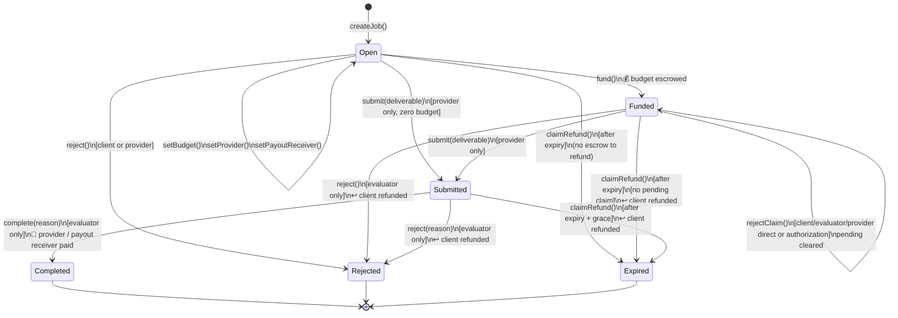
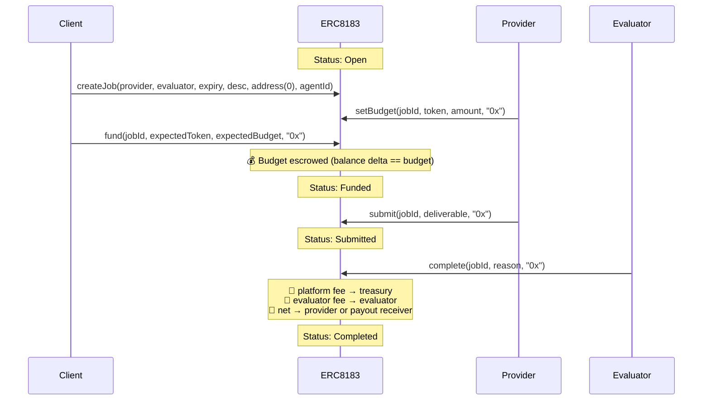
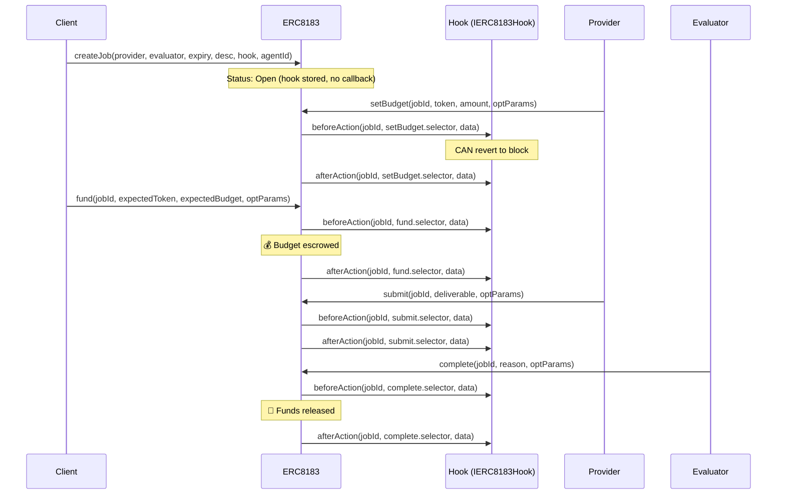

# ERC-8183 Flow Diagrams

## State Machine



Claims have separate slow and fast paths while the job remains `Funded`. In the slow path, the provider calls `submitClaim` or signs `submitClaimWithAuthorization` before expiry to record a pending nonzero-deliverable claim. The client or evaluator then approves or rejects it, directly or through `approveClaimWithAuthorization` / `rejectClaimWithAuthorization`; the provider can also call or sign `rejectClaim` to withdraw their own pending claim. Rejected claim hashes remain consumed, so an identical claim cannot be filed again unless the provider changes `cumulativeAmount`, the deliverable, or `optParams`. In the fast path, the client calls `settleClaim` or signs `settleClaimWithAuthorization` before expiry to release the new cumulative delta immediately. The fast path is independent of pending milestone claims: streaming-style settlements can continue while a provider claim is pending, and they reduce the remaining delta payable if that claim is later approved. The pending claim itself remains open until `approveClaim`, `rejectClaim`, provider withdrawal, final `submit`, or terminal job rejection closes it. Both paths settle only `cumulativeAmount - settledAmount`, and both use the configured platform and evaluator fee split for that delta. Claim settlement payouts use the same provider-side payout receiver and optional `IDisburser.onDisbursement` callback path as final completion. The evaluator fee is part of the configured payment economics even for client-initiated fast settlements where no evaluator action occurs. If the provider later calls `submit` for the final deliverable, that submission supersedes any pending claim and clears it because the provider is requesting the full remaining escrow through the normal completion path. If the evaluator rejects the funded job while a claim is pending, that terminal job rejection also rejects and clears the pending claim with the job rejection reason.

After expiry, `claimRefund` is callable by anyone. For `Submitted` jobs, it is gated by an additional `EVALUATION_GRACE_PERIOD` (1 hour) so that an evaluator who is mid-review cannot be censored by a third-party refund call. A `Funded` job with a pending provider claim cannot be refunded until that claim is approved or rejected; this forces explicit resolution before the remaining escrow can be closed out. Providers cannot file new claims after expiry, but pending claims have no post-expiry approval/rejection deadline so authorized parties can still resolve them. If streaming settlements already moved `settledAmount` to or beyond the pending claim's cumulative amount, approving that claim reverts with `NoNewSettlement`; the claim must be rejected or withdrawn to close the lifecycle. If all parties stay idle, the remaining escrow stays parked until the client/evaluator rejects or approves the claim, or the provider withdraws it. Refunds, claim settlements, and final completion only use the unsettled escrow balance, so funds released by claims are not double-paid or double-refunded.

For indexing, `JobCreated` includes `description` and `providerAgentId` so event-only indexers can reconstruct a job without a storage read. `providerAgentId` is `0` when the provider is unset at creation; `ProviderSet` still covers the assign-later path. `Settled` is the generic cumulative accounting event emitted for every claim delta. `ClaimSubmitted`, `ClaimApproved`, `ClaimSettled`, and `ClaimRejected` describe the claim lifecycle path and any associated deliverable/reason. `PaymentReleased` is emitted only when a positive provider net transfer occurs.

`ERC8183WithAuthorization` uses the same EIP-712 domain as the base protocol: name `ERC8183`, version `1`. The authorization contract extends ERC8183 entrypoints rather than creating a separate signing domain; upgraded proxies can call the admin-gated `initializeAuthorizationV2()` during `upgradeToAndCall` to initialize EIP-712 storage when the prior implementation did not already do so. Authorizations use packed `(signer, uint72 nonce)` replay protection. A signer can directly call `cancelAuthorization(nonce)` to burn one of their own outstanding nonces; this function is not relayed and is deliberately callable while paused so users can revoke signed messages during an incident. Terminal evaluator signatures bind the job's `submittedAt` value: `0` for Open/Funded jobs and the stored submission timestamp for Submitted jobs.

## Sequence — Typical Job Flow (No Hook)



## Sequence — Claim Settlement

```mermaid
sequenceDiagram
    participant C as Client
    participant AC as ERC8183
    participant P as Provider
    participant E as Evaluator
    participant R as PayoutReceiver

    Note over AC: Status: Funded

    alt Slow path: provider claim request
        P->>AC: submitClaim(jobId, cumulativeAmount, deliverable, optParams)
        Note over AC: pending claim hash stored
        C->>AC: approveClaim(jobId, cumulativeAmount, deliverable, optParams)
        Note over AC: 💸 delta released through payout receiver
        AC-->>R: transfer(net); optional onDisbursement(..., approveClaim.selector, ...)
    else Fast path: client-authorized settlement
        C->>AC: settleClaim(jobId, cumulativeAmount, deliverable, optParams)
        Note over AC: 💸 delta released immediately through payout receiver
        AC-->>R: transfer(net); optional onDisbursement(..., settleClaim.selector, ...)
    end

    Note over C,AC: Relayed fast path: client signs SettleClaimAuthorization,<br/>relayer calls settleClaimWithAuthorization(...)
    Note over P,AC: Relayed slow path: provider signs SubmitClaimAuthorization,<br/>relayer calls submitClaimWithAuthorization(...)
```

## Sequence — Job with Hook

`createJob` is not hookable in the reference implementation — the hook is stored on the job but no callbacks fire on creation. Hooks begin firing on `setBudget`.



## Sequence — Job with Payout Receiver

`payoutReceiver` separates job authorization from provider-side payout custody. If unset, ERC8183 pays the provider. If set, ERC8183 pays the receiver.

- The provider can set or update the receiver while the job is `Open`.
- The receiver is locked once the job is `Funded`.
- Receivers can be EOAs, smart accounts, or contracts.
- Contracts advertising `IDisburser` via ERC-165 at payout time receive `onDisbursement` after payout.
- Completion and claim settlements share the same receiver and callback path.
- Refunds and platform/evaluator fee routing are unchanged.

The receiver can be any address except the ERC8183 escrow contract itself or the job's payment token. Callback detection is dynamic, so a receiver with no code when set can later deploy code and receive callbacks if it advertises `IDisburser` when paid. If it is an `IDisburser`, a reverting callback rolls back completion or settlement, including platform and evaluator fee transfers, so providers should choose receiver contracts that do not unconditionally revert. Evaluators can reject a Funded or Submitted job instead of completing into a reverting receiver, which refunds the client and pays no one.

```mermaid
sequenceDiagram
    participant C as Client
    participant AC as ERC8183
    participant P as Provider
    participant E as Evaluator
    participant R as PayoutReceiver

    C->>AC: createJob(..., hook, agentId)
    Note over AC: payoutReceiver defaults to address(0); pays provider
    P->>AC: setPayoutReceiver(jobId, newReceiver)
    Note over AC: provider-only, Open only; locked once Funded
    P->>AC: setBudget(jobId, token, amount, "0x")
    C->>AC: fund(jobId, expectedToken, expectedBudget, "0x")
    Note over AC: Status: Funded

    alt Provider claim settlement
        P->>AC: submitClaim(jobId, amount, deliverable, optParams)
        E->>AC: approveClaim(jobId, amount, deliverable, optParams)
        Note over AC: Pending claim approved;<br/>delta released through payout receiver
    else Fast client settlement
        C->>AC: settleClaim(jobId, amount, deliverable, optParams)
        Note over AC: Delta released immediately through payout receiver
    else Final completion
        P->>AC: submit(jobId, deliverable, "0x")
        E->>AC: complete(jobId, reason, optParams)
    end

    Note over AC: 💸 platform fee → treasury<br/>💸 evaluator fee → evaluator
    AC->>R: transfer(net) [ERC-20]
    alt Receiver advertises IDisburser
        AC->>R: onDisbursement(jobId, triggering.selector, token, net, optParams)
        Note over R: CAN revert and roll back the settlement or completion
    else EOA or plain receiver contract
        Note over R: No callback
    end
```

When supported, `onDisbursement` runs after the ERC-20 transfer, so receiver contracts can split funds they already control without `transferFrom` allowances.
